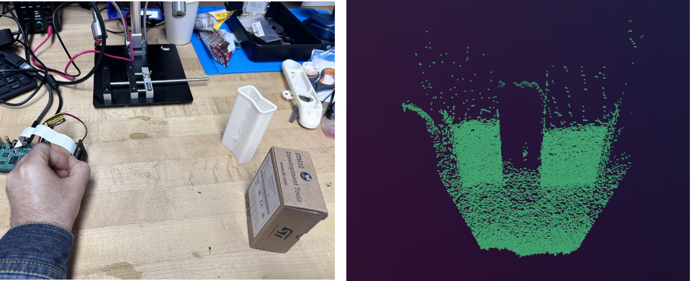

# Arducam ToF Rerun Example
<p align="center">
  
</p>

## Overview

This project is a simple Python example that reads the depth images from the Arducam ToF camera, computes the corresponding pointcloud, and visualizes them using the rerun.io software. The IMX316 camera chip on the module obtains the depth by calculating the phase difference between transmitted modulated pulses. The resolution of the camera is 240*180. Currently, it has two range modes: 2 meters and 4 meters. The measurement error is within 2 cm. The depth camera supports CSI and USB but in this example, we use a Raspberry Pi 4 to communicate with it (CSI).

## Installation
We assume the camera is physically connected to the Raspberry Pi as explained [here](https://docs.arducam.com/Raspberry-Pi-Camera/Tof-camera/Getting-Started/).

### Clone this repository
Clone this repository and enter the directory:

```shell
  git https://github.com/Rooholla-KhorramBakht/arducam_tof_rerun.git
  cd arducam_tof_rerun
  ./Install_dependencies_pi.sh
```
After rebooting the board, make sure the camera is recognized by running the following command:

```bash
dmesg | grep arducam
```
If successful, you should see:
```bash
[   11.516708] arducam-pivariety 10-000c: firmware version: 0x10002
[   12.122025] arducam-pivariety 10-000c: Consider updating driver arducam-pivariety to match on endpoints
```
Finally, install the Python library needed for communicating with the camera:
```bash
pip3 install rerun-sdk ArducamDepthCamera opencv-python "numpy<2.0.0"
```

## Rerun Visualization Example
Go through the notebook [rerun_visulizer.ipynb](notebooks/rerun_visulizer.ipynb) to see how to read the camera in python and send the output to the rerun visualizer in real-time!

